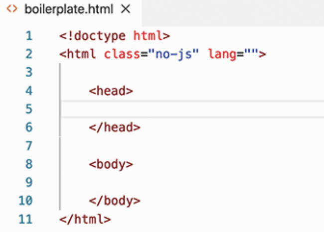
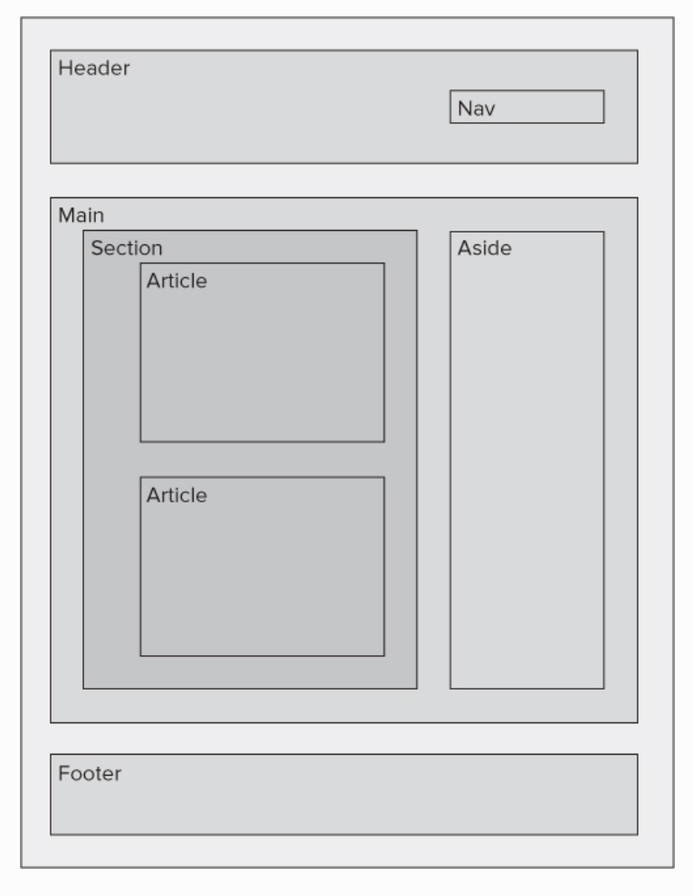
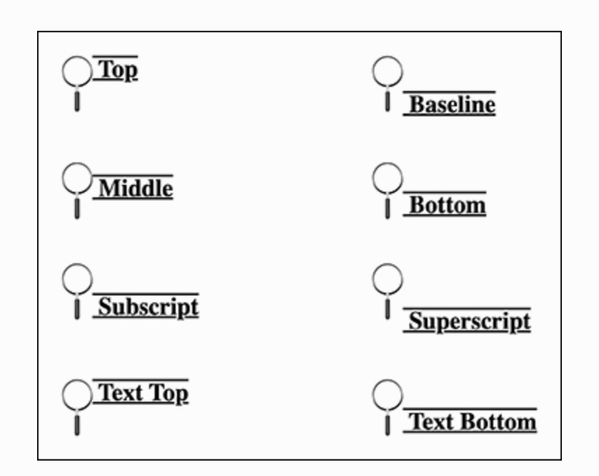
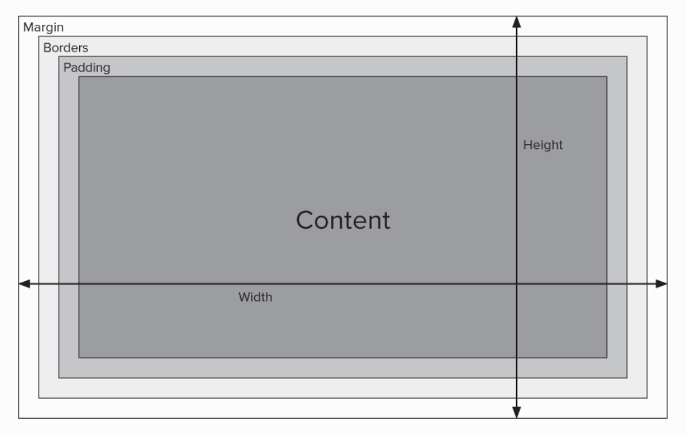
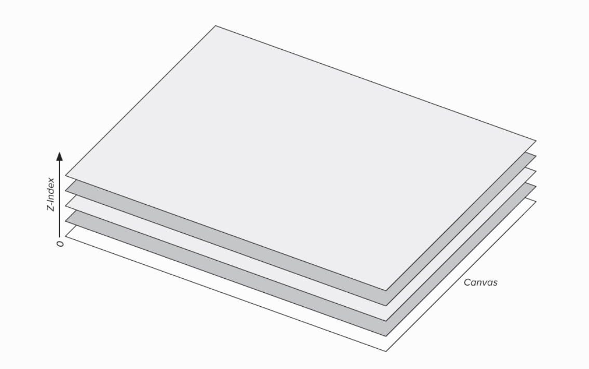

在JetBrains的Academy做Frontend的练习，因为学习得太快了，很多东西没有掌握，后面做实操的时候感觉很痛苦。还是乖乖的拿本书慢
慢的学吧。

# Html Syntax

- 基本结构

  

- head标签中可以包含

  - title 网页标题

  - meta 这个里面的信息不是显示给用户的，而是主要面向搜索引擎的。[这里](https:
    //developer.mozilla.org/en-US/docs/Web/HTML/Element/meta)有完整的支持的属性列表。**meta标签不需要闭合。**

    ><meta name="description" content="A basic HTML boilerplate file.">

  - 之前还学过里面可以用link来连接css文件，这里暂时没有讲。

# Html basic elemets

- 段落p
- 标题h1~h6
- 列表ol/ul分别为数字和符号列表，每项用li来标记
- 引用blockquote，用cite来标记引用源
- 格式
  - 加粗strong或者b
  - 强调em，文字变成斜体；
  - 语义强调i
  - 下划线u
  - 删除线s   (strike已过时) 意思是此内容目前已经不再正确
  - 删除线del 意思和s稍有不同，表示此内容要删除掉
  - 插入ins 表现的形式是加了下划线
  - 突出显示mark
  - 小字体small 用来标记一些笔记，边注等内容
  - 上下标sup、sub
  - 时间time
  - 缩写abbr
  - 换行br

# Link

- 基本形式为<a href=...></a>
- 页面内链接可以用href="#id"的形式

# Structure and Layout with HTML

- 基本模型

  

- 区块 main, section, article, aside， 另外div也常用来表示那些功能不明确的区块；

# Media

- 

- figure是一个比img更加大的标签，里面可以包含标签和一些其他的标签，是一个独立的容器

- img的srcset属性，可以添加多个图片文件

  >“src="space-medium.jpg" />”
  >
  >摘录来自: Joe Casabona. “HTML and CSS: Visual QuickStart Guide。” Apple Books.

其中4x表示4次

- 视频video和音频audio标签

# Tables and Other Structured Data Elements

- table表格
- caption标题
- thead表头
- tbody表体
- tr行
- td数据
- th不太明白
- tfoot表脚
- colspan/rowspan设置跨行跨列属性

----

描述型列表

- dl描述型列表
- dt列表项
- dd描述项

# Web Forms

- 表单form
- 输入input
  - text
  - radio
  - checkbox
  - email
  - file
  - submit
  - image
  - hidden
- textarea
- select
- label
- date

# Advanced and experimental features

- canvas画布
- storage离线存储

# Introduction to CSS

- 内部使用时用style标签

- 链接外部css

  >“<link rel="stylesheet" → href="style.css" />”
  >
  >摘录来自: Joe Casabona. “HTML and CSS: Visual QuickStart Guide。” Apple Books.

# Targeting elements

- 多个标签

  >“p, ul, ol { color: green; }”
  >
  >摘录来自: Joe Casabona. “HTML and CSS: Visual QuickStart Guide。” Apple Books.

- .classname

- \#id

- 多个class

  > .intro, .outro {...}

- p a选择p标签的字标签中的a标签 (所有后代)
- p > a只选择直接子标签
- div + p 选择div标签**后**的第一个p标签
- div ~ p 选择div标签**后**的所有p标签
- div, p 选择div和p
- .class1.class2选择1和2一起具备的标签
- [attribute]选择属性
- [attribute=value]选择属性并匹配值
- [attribute~=value]选择属性中包含value的标签
- [attribute|=value]选择属性中以value开始的标签
- [attribute^=value]感觉和上面是一样的
- [attribute$=value]匹配属性结尾
- [attribute*=value]感觉和~=是一样的

| Selector                                                     | Example               | Example description
| | ------------------------------------------------------------ | --------------------- |
------------------------------------------------------------ | | [:active](https:
//www.w3schools.com/cssref/sel_active.asp)   | a:active              | Selects the active link
| | [::after](https://www.w3schools.com/cssref/sel_after.asp)    | p::after              | Insert something after the
content of each <p> element       | | [::before](https://www.w3schools.com/cssref/sel_before.asp)  | p::before
| Insert something before the content of each <p> element      | | [:checked](https:
//www.w3schools.com/cssref/sel_checked.asp) | input:checked         | Selects every checked <input> element
| | [:default](https://www.w3schools.com/cssref/sel_default.asp) | input:default         | Selects the default <input>
element                          | | [:disabled](https://www.w3schools.com/cssref/sel_disabled.asp) | input:disabled
| Selects every disabled <input> element                       | | [:empty](https:
//www.w3schools.com/cssref/sel_empty.asp)     | p:empty               | Selects every <p> element that has no children
(including text nodes) | | [:enabled](https://www.w3schools.com/cssref/sel_enabled.asp) | input:enabled         |
Selects every enabled <input> element                        | | [:first-child](https:
//www.w3schools.com/cssref/sel_firstchild.asp) | p:first-child         | Selects every <p> element that is the first
child of its parent | | [::first-letter](https://www.w3schools.com/cssref/sel_firstletter.asp) | p::first-letter       |
Selects the first letter of every <p> element                | | [::first-line](https:
//www.w3schools.com/cssref/sel_firstline.asp) | p::first-line         | Selects the first line of every <p> element
| | [:first-of-type](https://www.w3schools.com/cssref/sel_first-of-type.asp) | p:first-of-type       | Selects every <p>
element that is the first <p> element of its parent | | [:focus](https://www.w3schools.com/cssref/sel_focus.asp)     |
input:focus           | Selects the input element which has focus                    | | [:fullscreen](https:
//www.w3schools.com/cssref/sel_fullscreen.asp) | :fullscreen           | Selects the element that is in full-screen mode
| | [:hover](https://www.w3schools.com/cssref/sel_hover.asp)     | a:hover               | Selects links on mouse over
| | [:in-range](https://www.w3schools.com/cssref/sel_in-range.asp) | input:in-range        | Selects input elements with
a value within a specified range | | [:indeterminate](https://www.w3schools.com/cssref/sel_indeterminate.asp) | input:
indeterminate   | Selects input elements that are in an indeterminate state    | | [:invalid](https:
//www.w3schools.com/cssref/sel_invalid.asp) | input:invalid         | Selects all input elements with an invalid value
| | [:lang(*language*)](https://www.w3schools.com/cssref/sel_lang.asp) | p:lang(it)            | Selects every <p>
element with a lang attribute equal to "it" (Italian) | | [:last-child](https:
//www.w3schools.com/cssref/sel_last-child.asp) | p:last-child          | Selects every <p> element that is the last
child of its parent | | [:last-of-type](https://www.w3schools.com/cssref/sel_last-of-type.asp) | p:last-of-type        |
Selects every <p> element that is the last <p> element of its parent | | [:link](https:
//www.w3schools.com/cssref/sel_link.asp)       | a:link                | Selects all unvisited links
| | [:not(*selector*)](https://www.w3schools.com/cssref/sel_not.asp) | :not(p)               | Selects every element
that is not a <p> element              | | [:nth-child(*n*)](https://www.w3schools.com/cssref/sel_nth-child.asp) | p:
nth-child(2)        | Selects every <p> element that is the second child of its parent | | [:nth-last-child(*n*)](https:
//www.w3schools.com/cssref/sel_nth-last-child.asp) | p:nth-last-child(2)   | Selects every <p> element that is the
second child of its parent, counting from the last child | | [:nth-last-of-type(*n*)](https:
//www.w3schools.com/cssref/sel_nth-last-of-type.asp) | p:nth-last-of-type(2) | Selects every <p> element that is the
second <p> element of its parent, counting from the last child | | [:nth-of-type(*n*)](https:
//www.w3schools.com/cssref/sel_nth-of-type.asp) | p:nth-of-type(2)      | Selects every <p> element that is the second
<p> element of its parent | | [:only-of-type](https://www.w3schools.com/cssref/sel_only-of-type.asp) | p:only-of-type
| Selects every <p> element that is the only <p> element of its parent | | [:only-child](https:
//www.w3schools.com/cssref/sel_only-child.asp) | p:only-child          | Selects every <p> element that is the only
child of its parent | | [:optional](https://www.w3schools.com/cssref/sel_optional.asp) | input:optional        | Selects
input elements with no "required" attribute          | | [:out-of-range](https:
//www.w3schools.com/cssref/sel_out-of-range.asp) | input:out-of-range    | Selects input elements with a value outside a
specified range | | [::placeholder](https://www.w3schools.com/cssref/sel_placeholder.asp) | input::placeholder    |
Selects input elements with the "placeholder" attribute specified | | [:read-only](https:
//www.w3schools.com/cssref/sel_read-only.asp) | input:read-only       | Selects input elements with the "readonly"
attribute specified | | [:read-write](https://www.w3schools.com/cssref/sel_read-write.asp) | input:read-write      |
Selects input elements with the "readonly" attribute NOT specified | | [:required](https:
//www.w3schools.com/cssref/sel_required.asp) | input:required        | Selects input elements with the "required"
attribute specified | | [:root](https://www.w3schools.com/cssref/sel_root.asp)       | :root                 | Selects
the document's root element                          | | [::selection](https:
//www.w3schools.com/cssref/sel_selection.asp) | ::selection           | Selects the portion of an element that is
selected by a user | | [:target](https://www.w3schools.com/cssref/sel_target.asp)   | #news:target          | Selects
the current active #news element (clicked on a URL containing that anchor name) | | [:valid](https:
//www.w3schools.com/cssref/sel_valid.asp)     | input:valid           | Selects all input elements with a valid value
| | [:visited](https://www.w3schools.com/cssref/sel_visited.asp) | a:visited             | Selects all visited links
|

# Styling Text

- font-family

- font-size default size is 16px

- em代表父标签的字体大小

- rem代表根标签的字体大小

- font-weight normal bold lighter bolder

- font-style normal italic oblique

  >w3c官方解释为：
  >
  >italic：浏览器会显示一个斜体的字体样式。
  >
  >oblique：浏览器会显示一个倾斜的字体样式。
  >
  >可以发现关键之处为斜体和倾斜。我们可以理解成Italic是使用了文字本身的斜体属性，oblique是让没有斜体属性的文字做倾斜处理。
  >
  >所以有少量的不常用字体没有斜体属性，如果我们使用Italic则会没有效果。

- text-decoration none underline overline line-through

- text-decoration 还可以加另外两个属性，线形solid double dotted dashed wavy 还有颜色

- text-align left right center justify

- vertical-align baseline sub sup text-top text-bottom top middle bottom

  


# Color in CSS

- 颜色模式
  - HEX
  - RGB
  - RGBA
  - HSLA
- 渐变
  - linear-gradient
  - radial-gradient

# Using CSS for page layout

- 显示属性

  - block
  - inline
  - inline-block
  - none

- overflow

  - hidden
  - scroll

- Padding border margin etc.

  

- float 把元素从正常的排列中抽出来，显示在母容器的左边或右边

- clear可以让元素显示在float元素下面

- position

  - static这个是默认值
  - relative
  - fixed 在整个页面的固定位置
  - absolute 在容器的固定位置
  - sticky 滚动到某一个位置后固定不动

- z-index

  

# Layouts with CSS grid and flexbox

## flexbox

- flex-wrap: wrap, nowrap
- flex-direction
  - row
  - row-reverse
  - column
  - column-reverse
- flex-basis 相当于设定一个最小值
- flex-grow/shrink 设置元素相应的伸展和收缩的比例, flex可以将grow/shrink/basis写在一起；
- justify-content
  - flex-start
  - flex-end
  - center
  - space-between
  - space-around
  - space-evenly
- vertical-alignment 与justify-content一样用法

## Using CSS grid layout

- grid-template-columns/rows

```css main { display: grid; grid-template-columns: 30% 30% 30%; grid-gap: 10px 20px; } ```

`grid-template-row`与此用法相同。

- fr单位 (可用空间的等分单位)
-
